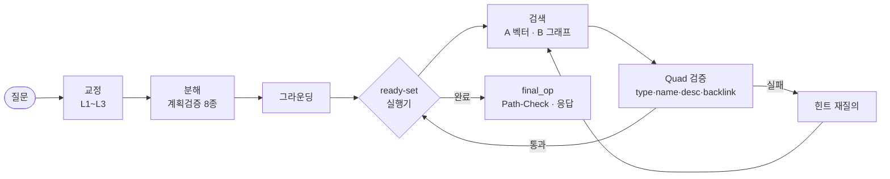
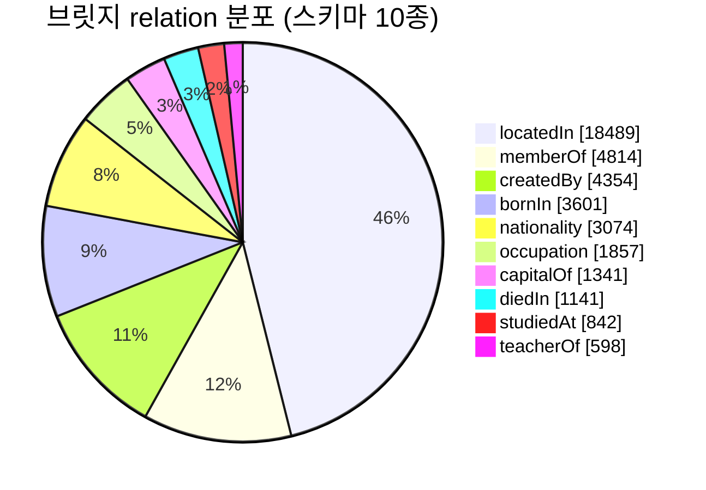

# VeriHop

한국어 복합 질문("모차르트가 태어난 도시의 대표 축제는?")을 hop 단위로 분해하고, 각 hop의 검색 결과를 **경량 지식그래프 기반 4중 검증**(type / name / desc / backlink)으로 걸러내는 Agentic RAG 시스템. 검증에 실패하면 그래프 정보를 힌트로 질의를 재작성해 다시 검색한다.

차별점은 검색 결과 검토를 LLM judge(확률적)가 아니라 **그래프 조회(결정적)**로 한다는 것이다. 4중 검증 중 3종이 LLM 호출 없이 동작한다.

> 가천 AI 부트캠프 프로젝트 12번 · 14일 · 로컬 실행 데모.

## 파이프라인



검증 방식만 바꿔 4모드를 비교한다: **Baseline**(원질의 1회) · **Agent-basic**(LLM judge) · **Ours−G**(전체 파이프라인 + LLM judge) · **Ours**(그래프 검증). Ours가 Ours−G보다 나으면 이득이 분해가 아니라 검증 방식에서 온 것이다.

## 진행 현황

- [x] W0.1 KorQuAD 수율 체크 — 가정 2개 확인
- [x] W1.1 코퍼스 구축 (KorQuAD 문서 범위, 10,615문단)
- [x] W1.2 FAISS 인덱싱 (Upstage solar 임베딩) + 검색 스팟체크 (단일홉 n=5000: R@1 83% · R@5 97% · R@10 98.5%)
- [ ] W1.3 트리플 추출 → 지식그래프
- [ ] W1.5 Baseline 측정 **(게이트)**
- [ ] W2~W3 코어 파이프라인 · 검증 · 재질의
- [ ] W4 3단 비교 **(게이트: Ours > Agent-basic)**

## W0.1 수율 체크 결과

브릿지 쌍(한 QA의 답이 다른 QA의 엔티티가 되는 쌍)으로 멀티홉 평가셋을 만들 수 있는지 확인했다. KorQuAD 1.0 train+dev **66,181 QA**를 문자열 처리만으로 5초에 집계.

| 항목 | 값 | 판정 |
|---|---|---|
| 원시 브릿지 쌍 | 234,186 | 목표 300 대비 **PASS** |
| 빌드 가능 (양쪽 hop 스키마 relation) | **1,969** | 목표 100~200의 약 10배 **PASS** |
| 코퍼스 | 1,545문서 / 10,615문단 | 3만 상한 이내 |

relation 분포는 가설 10종 스키마가 실제로 유효함을 보여준다(교체 불필요).



## 문서

설계와 계약은 [Docs/handoff/](Docs/handoff/)에 있다.

- [00 용어사전](Docs/handoff/00_용어사전.md) · [01 기획서](Docs/handoff/01_기획서.md) · [02 아키텍처(ADR)](Docs/handoff/02_아키텍처_결정기록.md)
- [03 파이프라인 명세](Docs/handoff/03_파이프라인_명세.md) (구현 계약) · [04 WBS](Docs/handoff/04_WBS.md) · [05 평가 명세](Docs/handoff/05_평가_명세.md)
- [06 프로젝트 구조](Docs/handoff/06_프로젝트_구조.md) · [07 첫 태스크](Docs/handoff/07_첫번째_태스크.md)

## 구조

```
configs/     settings.yaml · relations.yaml · prompts/
src/verihop/ domain(순수 규칙) ← usecases(오케스트레이션) ← adapters(구현) ← bootstrap
             ports.py(seam 5개) · models.py(§0)
scripts/     w0_yield_check · build_corpus · build_index · build_graph · build_multihop_set
eval/        run_eval · metrics · report
apps/        cli · streamlit_app
tools/       check_layers.sh (계층 의존 게이트)
```

계층 의존은 `tools/check_layers.sh`가 검사한다(커밋 전 통과가 done 기준, ADR-10).

## 실행

```bash
# W0.1: KorQuAD 1.0 train+dev JSON을 data/raw/ 에 두고
python3 scripts/w0_yield_check.py     # → data/w0/report.md
python3 scripts/build_corpus.py       # → data/corpus.jsonl
```
