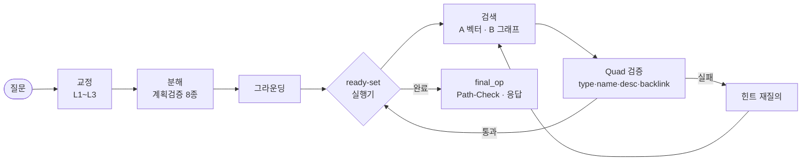
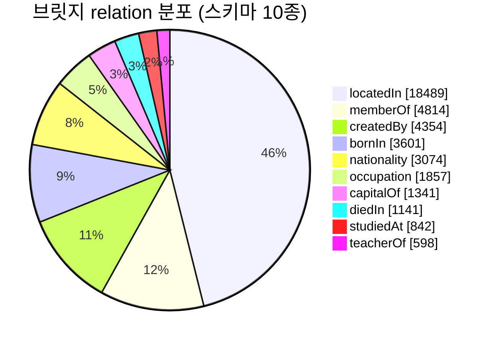

# VeriHop

한국어 복합 질문("모차르트가 태어난 도시의 대표 축제는?")을 hop 단위로 분해하고, 각 hop의 검색 결과를 **경량 지식그래프 기반 4중 검증**(type / name / desc / backlink)으로 걸러내는 Agentic RAG 시스템. 검증에 실패하면 그래프 정보를 힌트로 질의를 재작성해 다시 검색한다.

차별점은 검색 결과 검토를 LLM judge(확률적)가 아니라 **그래프 조회(결정적)**로 한다는 것이다. 4중 검증 중 3종이 LLM 호출 없이 동작한다.

> 가천 AI 부트캠프 프로젝트 12번 · 14일 · 로컬 실행 데모.

## 파이프라인


```mermaid
flowchart LR
    Q([질문]) --> C[교정<br/>L1~L3] --> D[분해<br/>계획검증 8종] --> G[그라운딩] --> X{ready-set<br/>실행기}
    X --> S[검색<br/>A 벡터 · B 그래프]
    S --> V[Quad 검증<br/>type·name·desc·backlink]
    V -->|통과| X
    V -->|실패| R[힌트 재질의]
    R --> S
    X -->|완료| F[final_op<br/>Path-Check · 응답]
```

검증 방식만 바꿔 4모드를 비교한다: **Baseline**(원질의 1회) · **Agent-basic**(LLM judge) · **Ours−G**(전체 파이프라인 + LLM judge) · **Ours**(그래프 검증). Ours가 Ours−G보다 나으면 이득이 분해가 아니라 검증 방식에서 온 것이다.

## 진행 현황

- [x] W0.1 KorQuAD 수율 체크 — 가정 2개 확인
- [x] W1.1 코퍼스 구축 (10,871문단, KorQuAD + 2Wiki 적응 + 데모용 5문서)
- [x] W1.2 FAISS 인덱싱(Chroma에서 변경, ADR-11) + 검색 스팟체크
- [x] W1.3 지식그래프 (전체 코퍼스 22.8배 확대 → 가지치기로 정밀도 70%→**98%** 복구, 6,313노드·5,438엣지)
- [x] W1.5 Baseline 측정 **(게이트)** — 멀티홉(2Wiki 적응 127문항) Hits@5 40.2% / @10 48.8%
- [x] W2 코어 파이프라인 E2E (분해·그라운딩·검증·재질의·응답조립)
- [x] 일반 RAG 대조군(`plain_rag.py`) — 시연 대시보드용, 임베딩검색+LLM답변만
- [x] **W3.4 게이트: 시나리오 B 최초 완전 재현** — 모차르트→bornIn→잘츠부르크→hostsEvent→잘츠부르크 페스티벌, ANSWERED·confidence 0.85·path_check True
- [x] **W4.3 게이트: Ours > Agent-basic 통과(2026-07-27)** — 멀티홉 127문항(gold 오염 4건 제외, n=123).
      raw EM은 Ours 5.7% > Agent-basic 4.1%. 핵심 KPI인 고신뢰오답 비율(05 §4, ANSWERED인데
      오답)은 Agent-basic **100%**(13/13 전부 오답) vs Ours **50%**(6건 중 3건)로 목표
      ("Agent-basic 대비 절반 이하")를 정확히 충족. 단, ANSWERED 절대 표본이 작다(13건·6건)는
      한계가 있음 — 상세: [Docs/문제점.md](Docs/문제점.md), [진행기록](Docs/진행기록.md)

## W0.1 수율 체크 결과

브릿지 쌍(한 QA의 답이 다른 QA의 엔티티가 되는 쌍)으로 멀티홉 평가셋을 만들 수 있는지 확인했다. KorQuAD 1.0 train+dev **66,181 QA**를 문자열 처리만으로 5초에 집계.

| 항목 | 값 | 판정 |
|---|---|---|
| 원시 브릿지 쌍 | 234,186 | 목표 300 대비 **PASS** |
| 빌드 가능 (양쪽 hop 스키마 relation) | **1,969** | 목표 100~200의 약 10배 **PASS** |
| 코퍼스 | 1,545문서 / 10,615문단 | 3만 상한 이내 |

relation 분포는 가설 10종 스키마가 실제로 유효함을 보여준다(교체 불필요).


```mermaid
pie showData title 브릿지 relation 분포 (스키마 10종)
    "locatedIn" : 18489
    "memberOf" : 4814
    "createdBy" : 4354
    "bornIn" : 3601
    "nationality" : 3074
    "occupation" : 1857
    "capitalOf" : 1341
    "diedIn" : 1141
    "studiedAt" : 842
    "teacherOf" : 598
```

## 문서

설계와 계약은 [Docs/handoff/](Docs/handoff/)에 있다.

- [00 용어사전](Docs/handoff/00_용어사전.md) · [01 기획서](Docs/handoff/01_기획서.md) · [02 아키텍처(ADR)](Docs/handoff/02_아키텍처_결정기록.md)
- [03 파이프라인 명세](Docs/handoff/03_파이프라인_명세.md) (구현 계약) · [04 WBS](Docs/handoff/04_WBS.md) · [05 평가 명세](Docs/handoff/05_평가_명세.md)
- [06 프로젝트 구조](Docs/handoff/06_프로젝트_구조.md) · [07 첫 태스크](Docs/handoff/07_첫번째_태스크.md)

## 구조

```
configs/     settings.yaml · relations.yaml · prompts/
src/verihop/ domain(순수 규칙) ← usecases(오케스트레이션) ← adapters(구현) ← bootstrap
             ports.py(seam 5개) · models.py(§0) · plain_rag.py(일반 RAG 대조군)
scripts/     w0_yield_check · build_corpus · build_index · build_graph · build_alias
             build_multihop_set(KorQuAD 브릿지, 미사용) · build_2wiki_ko(2Wiki 적응, 실사용)
             add_demo_corpus
eval/        run_eval · retry_errors(ERROR만 재시도) · metrics
apps/        cli · plain_rag_cli · streamlit_app(데모 UI)
tools/       check_layers.sh (계층 의존 게이트)
```

계층 의존은 `tools/check_layers.sh`가 검사한다(커밋 전 통과가 done 기준, ADR-10).

## 실행

```bash
# 데모 UI (시나리오 A/B/C 프리셋, hop trace·검증뱃지·일반 RAG 비교 패널)
streamlit run apps/streamlit_app.py

# 4-arm 평가 (baseline은 Hits@k, 나머지는 EM)
python3 eval/run_eval.py --mode baseline --set multi
python3 eval/run_eval.py --mode agent_basic --set multi
python3 eval/run_eval.py --mode ours_g --set multi
python3 eval/run_eval.py --mode ours --set multi
# 레이트리밋 등으로 일부 ERROR 나면(results/{run_id}/per_question.jsonl에 status=ERROR)
python3 eval/retry_errors.py results/{run_id}

# 데이터 파이프라인 처음부터(W0~W1) 다시 만들 때
python3 scripts/w0_yield_check.py     # KorQuAD 1.0 train+dev JSON을 data/raw/ 에 두고 실행
python3 scripts/build_corpus.py       # → data/corpus.jsonl
python3 scripts/build_2wiki_ko.py --n 150 --pages 128   # → data/eval/multihop_2wiki.jsonl
python3 scripts/build_index.py
python3 scripts/build_graph.py --all --workers 4
python3 scripts/build_alias.py
```
